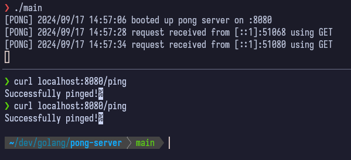

# Pong server 

Q: what's this?
A: a simple echo server that logs the ip and request method 

Q: What's it used for?
A: idk you tell me?

Q: How do i run it
A: `go build -o pong main.go && ./pong :8080`

